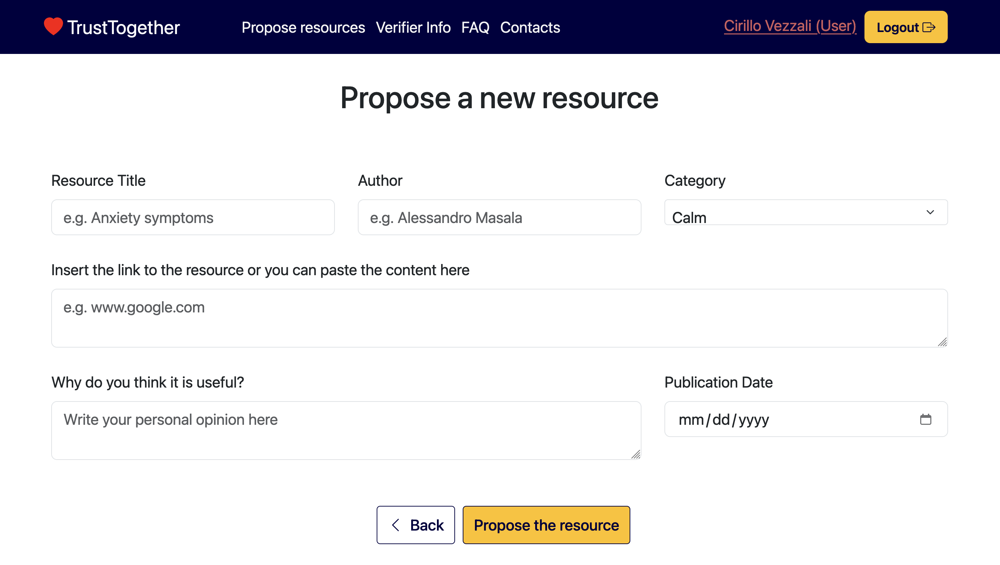
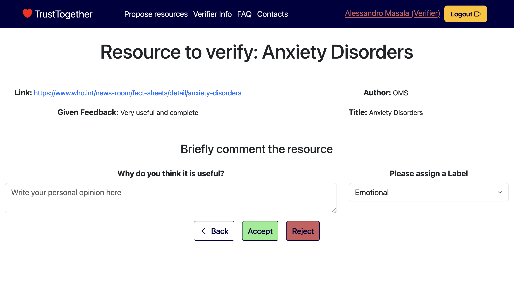
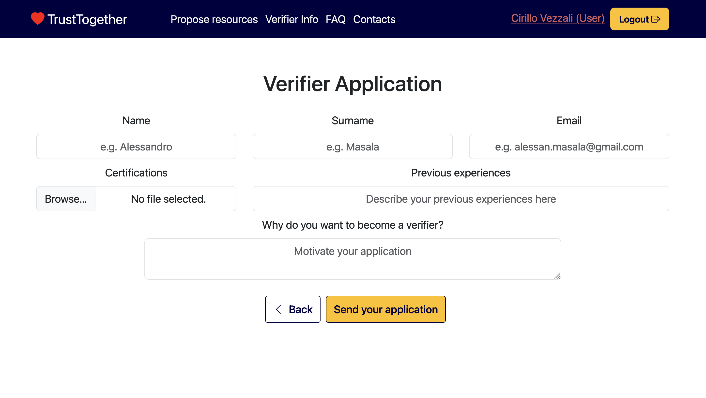

# SAFE-SOURCE 

A web platform designed to support students coping with anxiety by enabling a community-based approach to assess and share reliable mental health resources. Developed as part of the Human-Computer Interaction course at Politecnico di Torino, the project emphasizes trust, inclusivity, and collective validation to combat misinformation and foster a sense of support.

## 🛠️ Technology Stack

- **Frontend**: React, React Bootstrap, day.js  
- **Backend**: Node.js, Express, Passport.js  
- **Database**: SQLite  
- **Design**: Figma for wireframes and prototypes  
- **Authentication**: Cookie-based session login  
- **Security**: Encrypted user credentials  

## 📌 Features

- 🧠 Discover verified resources on anxiety and mental wellness  
- 📤 Propose new articles or tools for review  
- ✅ Become a verified user to help vet content  
- 💬 Community interaction with like/dislike feedback  
- 🔐 Role-based system (Normal, Verified users)  
- 📈 Usability-tested and user-centered design process

## 🖼️ Screenshots

- Users can propose new resources for review and addition.

### ➕ Submit Resource
- The view of admin page, showing resources submitted that admin has to approve.

### ✅ Verifier Application
- Registered users can apply to become verifiers.

## 🔍 Target Audience

Primarily university students struggling with anxiety who:

- Want **quick, trusted resources** during stressful moments
- Prefer to **learn from peers and shared experience**
- Seek **collaborative validation** rather than expert-only answers

## 📱 Access Modes

The platform is accessible via:

- 🌐 **Website**: Easy to reach for all users on any device with a browser  
- 📱 *(Future Scope)*: Mobile app version for quick access on-the-go

## 🎯 Tasks

| Difficulty | Task |
|-----------|------|
| Simple | Read an article about anxiety symptoms |
| Moderate | Submit a new resource for community evaluation |
| Complex | Apply and act as a **verified user** to assess submissions |

## 🖼️ Prototype & Testing

- **Low-, Medium-, and High-Fidelity prototypes** created in Figma
- **Usability tested** with real users (students), iterated based on feedback
- [🔗 View Figma Prototype](https://www.figma.com/proto/98pjJs20MNmfNrg4GA6Zop/Untitled?type=design&node-id=1-3)

## 🧪 Usability Testing

- **4 participants** (aged 22–25)
- Evaluated key user flows: resource browsing, submitting, applying to verify
- High success in tasks like liking and verifying resources
- Pain point identified: visibility of the verifier application page
- [🔗 Usability Testing Protocol](https://docs.google.com/document/d/1oT0Rr-ax9bxHoPj8JjLq1UXbPXCkrKqm0FhWK9oa6hg/edit?usp=sharing)

---

## 🚧 Limitations

- Some components use **hard-coded data**
- Dynamic backend verification flow is basic
- Search/filter features under refinement

---

## 💡 Future Improvements

- Enhanced search with auto-suggestions
- Email notifications for verification outcomes
- Expand to support more mental health domains
- Launch a mobile app for quicker access

---

## 📂 Repository Structure

- /client # React frontend
- /server # Express backend with SQLite
- /database # Preloaded test data
- /design # Figma exports and usability docs