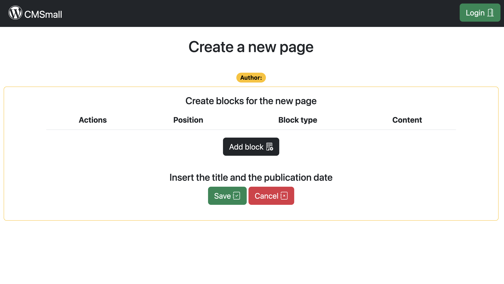

[](https://classroom.github.com/a/8AapHqUJ)
# Exam #1: "TrustTogether"
## Students: 
- s305206 MASALA ALESSANDRO
- s315908 Pegah Yarahmadi
- Soona Neysi
- Ibrahim Taib

## React Client Application Routes

- Route `/`: default route, render all the subpages
- Route `index`: contains the table of the pages that are publicated in exact moment of the visualization
- Route `/show/:pageId`: contains all the properties of the page and render it
- Route `/add`: contains the forms that allow the logged users to add a new page and its relative blocks
- Route `/edit/:pageId`: contains the forms that allow the logged users to edit a new page and its relative blocks
- Route `/login`: contains the form that allow the users to login 
- Route `*`: route that notify the user that the route does not exists

## API Server

### Page management

#### Get all pages

* HTTP method: `GET`  URL: `/api/pages`
* Description: Get the full list of pages that have the Date Publication less than today and filter the results based on the fact that the user is a Guest or ann Authenticated user.
* Request body: _None_
* Request query parameter: 
* Response: `200 OK` (success) 
* Error responses:  `500 Internal Server Error` (generic error)
* Response body: Array of objects, each describing one page:

``` json
[
  {
    "IdPage": 1,
    "Title": "The New Silk Road: China's Belt and Road Initiative and its Global Impact",
    "IdAuthor": 1,
    "DateCreation": "2023-05-04",
    "DatePublication": "2023-06-14",
    "Name": "Alessandro Masala"
  },
  {
    "IdPage": 2,
    "Title": "The Cold War: A global power struggle that defined the 20th century",
    "IdAuthor": 2,
    "DateCreation": "2023-04-11",
    "DatePublication": "2023-06-13",
    "Name": "Cirillo Vezzali"
  },
  ...
]
```


#### Get page by id

* HTTP method: `GET`  URL: `/api/pages/:pageId`
* Description: Get the page corresponding to the id
* Request body: _None_
* Response: `200 OK` (success)
* Error responses:  `500 Internal Server Error` (generic error), `404 Not Found` (not present or unavailable)
* Response body: One object describing the required page:

``` JSON
{
  "IdPage": 1,
  "Title": "The New Silk Road: China's Belt and Road Initiative and its Global Impact",
  "IdAuthor": 1,
  "DateCreation": "2023-05-04",
  "DatePublication": "2023-06-14",
  "Name": "Alessandro Masala"
}
```

#### Add a new page

* HTTP method: `POST`  URL: `/api/pages`
* Description: Add a new page to the pages of the authenticated user
* Request body: description of the object to add 
* Response: `201 OK` (success)
* Error responses: `503 Service Unavailable` (database error), `422 Unprocessable Content` (validation error), `401 Unathorized` (unathorized user)
* Response body: the object as represented in the database

``` JSON
{
  "IdPage": 1,
  "Title": "The New Silk Road: China's Belt and Road Initiative and its Global Impact",
  "IdAuthor": 1,
  "DateCreation": "2023-05-04",
  "DatePublication": "2023-06-14"
}
```

#### Delete an existing page

* HTTP method: `DELETE`  URL: `/api/pages/:pageId`
* Description: Delete an existing page if the page belongs to the authenticated user or an admin is trying to perform the delete
* Request body: _None_
* Response: `200 OK` (success)
* Response body: an empty object
* Error responses:  `503 Service Unavailable` (database error), `401 Unathorized` (unathorized user), `404 Not Found` (not present or unavailable)


#### Update an existing page

* HTTP method: `PUT`  URL: `/api/pages/:pageId`
* Description: Update values of an existing page, except the id, if the page belongs to the authenticated user or an admin is trying to perform the delete
* Request body: description of the object to update
* Response: `201 Created` (success)
* Error responses: `503 Service Unavailable` (database error), `401 Unathorized` (unathorized user), `404 Not Found` (not present or unavailable), `422 Unprocessable Content` (validation error)
* Response body: the object as represented in the database

``` JSON
{
  "IdPage": 1,
  "Title": "The New Silk Road: China's Belt and Road Initiative and its Global Impact",
  "IdAuthor": 1,
  "DatePublication": "2023-06-14",
  "Blocks": [
    {"Type":"Header", "Content": "I'm a header", "Position": 0},
    {"Type":"Paragraph", "Content": "I'm a par", "Position": 1},
    {"Type":"Header", "Content": "I'm another header", "Position": 2},
    {"Type":"Image", "Content": "I'm an img", "Position": 3}
  ]
}
```

#### Get all blocks of a given page

* HTTP method: `GET`  URL: `/api/pages/:pageId/blocks`
* Description: Get the full list of blocks that are identified by a given pageId
* Request body: _None_
* Request query parameter: 
* Response: `200 OK` (success) 
* Error responses:  `500 Internal Server Error` (generic error), `404 Not Found` (not present or unavailable)
* Response body: Array of objects, each describing one block:

``` json
[
  {
    "IdBlock": 0,
    "IdPage": 1,
    "Type":"Header", 
    "Content": "I'm a header", 
    "Position": 0
  },
  { 
    "IdBlock": 0,
    "IdPage": 1,
    "Type":"Paragraph", 
    "Content": "I'm a paragraph", 
    "Position": 1
  },
  ...
]
```

### Image management

#### Get all images

* HTTP method: `GET`  URL: `/api/images`
* Description: Get the full list of images
* Request body: _None_
* Request query parameter: 
* Response: `200 OK` (success) 
* Error responses:  `500 Internal Server Error` (generic error)
* Response body: Array of objects, each describing one image:

``` json
[
  {
    "Name": "image1.png"
  },
  {
    "Name": "image2.png"
  }
  ...
]
```

#### Get image by name

* HTTP method: `GET`  URL: `/api/images/:imageName`
* Description: Get the image corresponding to the given name
* Request body: _None_
* Response: `200 OK` (success)
* Error responses:  `500 Internal Server Error` (generic error)
* Response body: A file image:

``` JSON
  {
    "File": "http://localhost:3001/api/images/image1.png"
  }
```


### Users management

#### Get all users

* HTTP method: `GET`  URL: `/api/users`
* Description: Get the full list of users
* Request body: _None_
* Request query parameter: 
* Response: `200 OK` (success) 
* Error responses:  `500 Internal Server Error` (generic error)
* Response body: Array of objects, each describing one user:

``` json
[
  {
    "IdUser": 1,
    "Name": "Alessandro Masala"
  },
  {
    "IdUser": 2,
    "Name": "Cirillo Vezzali"
  }
  ...
]
```


### User management

#### Login

* HTTP method: `POST`  URL: `/api/sessions`
* Description: authenticate the user who is trying to login
* Error responses:  `500 Internal Server Error` (generic error), `401 Unauthorized User` (login failed)
* Request body: credentials of the user who is trying to login

``` JSON
{
    "username": "username",
      "name": "Alessandro Masala",
    "level": "Admin",
    "password": "password"
}
```

* Response: `200 OK` (success)
* Response body: authenticated user

``` JSON
{
    "username": "alessan.masala@gmail.com", 
    "name": "Alessandro Masala",
    "level": "Admin"
}
```


#### Check if user is logged in

* HTTP method: `GET`  URL: `/api/sessions/current`
* Description: check if current user is logged in and get her data
* Request body: _None_
* Response: `200 OK` (success)
* Error responses: `500 Internal Server Error` (generic error), `401 Unauthorized User` (user is not logged in)
* Response body: authenticated user

``` JSON
{
    "username": "alessan.masala@gmail.com", 
    "name": "Alessandro Masala",
    "level": "Admin"
}
```

#### Logout

* HTTP method: `DELETE`  URL: `/api/sessions/current`
* Description: logout current user
* Request body: _None_
* Response: `200 OK` (success)

* Response body: _None_

* Error responses: `500 Internal Server Error` (generic error), `401 Unauthorized User` (user is not logged in)


### SITE MANAGEMENT

#### Get site by id
* HTTP method: `GET`  URL: `/api/sites/:siteId`
* Description: Get the site corresponding to the id
* Request body: _None_
* Response: `200 OK` (success)
* Error responses:  `500 Internal Server Error` (generic error), `404 Not Found` (not present or unavailable)
* Response body: One object describing the required site:

``` JSON
{
  "IdSite": 1,
  "Name": "Welcome to CMSmall"
}
```

#### Update a site 
* HTTP method: `PUT`  URL: `/api/sites/:siteId`
* Description: Update name of an existing site title if the user is an admin 
* Request body: description of the object to update
* Response: `201 Created` (success)
* Error responses: `503 Service Unavailable` (database error), `401 Unathorized` (unathorized user), `404 Not Found` (not present or unavailable), `422 Unprocessable Content` (validation error)
* Response body: the object as represented in the database

``` JSON
{
  "IdSite": 1,
  "Name": "Welcome to CMSmall"
}
```

## Database Tables

- Table `Users` - contains IdUser, Name, Level, Email, Password, Salt
- Table `Pages` - contains IdPage, Title, IdAuthor, DateCreation, DatePublication
- Table `Blocks` - contains IdBlock, IdPage, Type, Content, Position
- Table `Images` - contains IdImage, Name
- Table `Site` - contains IdSite, Name
- Table `Likes` - contains IdLike, IdPage, IdUser, IsLike

## Main React Components

- `LoginForm` (in `Auth.jsx`): show a form that allows the users to login.
- `BlockForm` (in `BlockForm.jsx`): create the form to add/edit a new block 
- `BlocksT` (in `CreateBlocksTable.jsx`): create the table that contains the blocks and handle the toggle of the form that adds the blocks. Furthermore, it provides the actions to move the blocks up and down in the table and to edit/delete a block.
- `ImageSelector` (in `ImageSelector.jsx`): handle the selection of the images of the blocks. It takes the images (server side) and re-render each of them in a carousel that allow the user to select the preferred image.
- `Navigation` (in `Navigation.jsx`): create the navbar of the site, it also contains the buttons to handle the login/logout phase.
- `PageForms` (in `PageForm.jsx`): handles the two main forms of the site. One creates the blocks and the other sends the new title and the new publication date (if expressed). In case the admin is logged in, he can also modify/set the author.
- `MainLayout` (in `PageLayout.jsx`): contains the table component and handles the modification of the title of the entire site in case the admin is logged in
- `ShowLayout` (in `PageLayout.jsx`): shows the page and all its properties
- `AddLayout` (in `PageLayout.jsx`): allows the authenticated user to create a new page 
- `EditLayout` (in `PageLayout.jsx`): allows the authenticated user to edit only their page. In case the user is the admin, they can edit every page.
- `ShowPage` (in `PageShow.jsx`): component purpose and main functionality
- `PageTable` (in `PageTable.jsx`): contains all the pages that are already publicated (DatePublication <= today) in case the user is not logged in. In case the user is logged in (both as normal user or admin), can see all the pages.

## Screenshot





## Users Credentials

- alessan.masala@gmail.com, Alessandro (Admin)
- cirillo.vezzali@gmail.com, Cirillo (User)
- vanessa.giusti@gmail.com, Vaness (User)
- amanda.guariento@gmail.com, Amanda (Admin)


